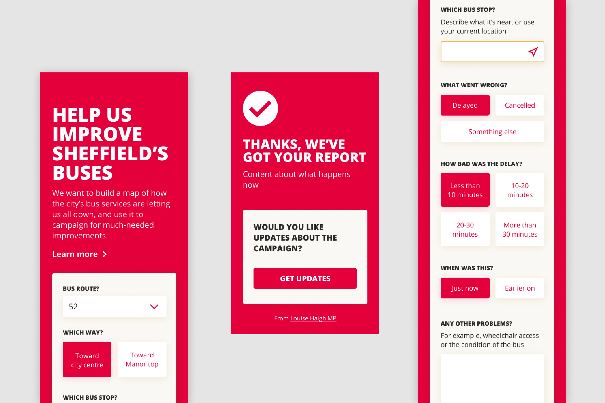

Unlike most of my work, this app was produced in an alarmingly short amount of time.

A local MP wanted a way for citizens to report issues with their bus service, so that the data could be used to map delays and cancellations throughout the city and campaign for better service.

Originally, I was asked to build a mobile app to make this happen, but eventually sold the client on the usability and cost benefits of a progressive web app instead.

In the interests of speed, I focused on the front-end experience and used Zapier's webhooks to handle form submissions and other back-end functionality. 

This worked great because it meant the app could be hosted and run for free using Netlify—useful because this project's budget had no allowances for ongoing costs.

I built the interface so that the vast majority of reports could be made in a few taps, with no typing needed whatsoever. For example, geolocating the user meant that they would not have to manually type out their current position.

I pre-rendered the app to static HTML using [`react-snap`](https://github.com/stereobooster/react-snap) to make sure it was speedy the first time users visited.

**[See the code](https://github.com/jhackett1/report-a-bus-problem)**