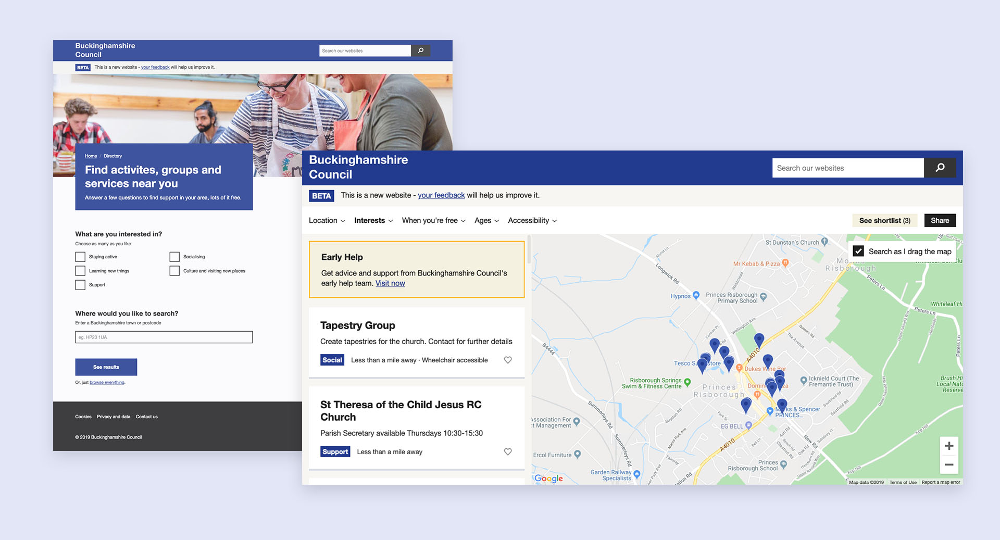
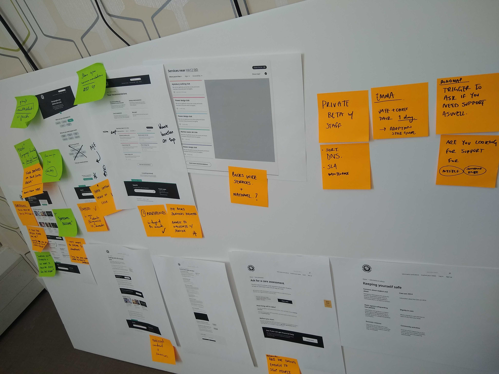
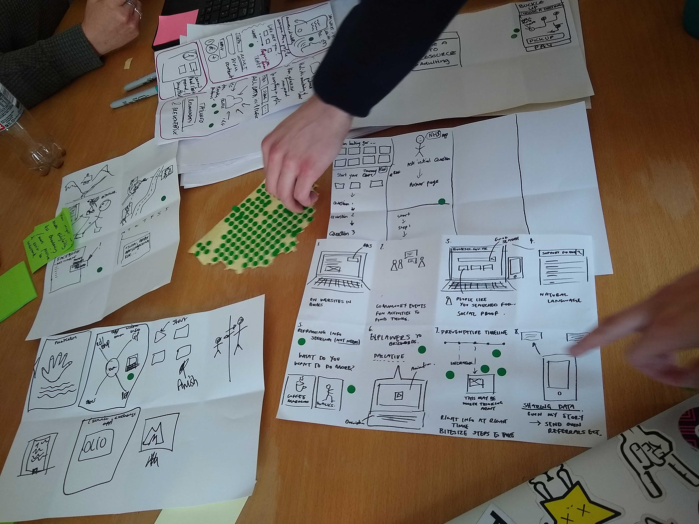

I designed and built a tool to untangle the complicated mix of support available to adults in need in Buckinghamshire.

When we experience certain kinds of hardship in life, it’s natural to turn to our council for help, but people often end up in a web of phone calls and assessments, unclear about the support options available.

Residents are surrounded by community and voluntary organisations that are ready and willing to help, but it can be hard to find them. 

Councils struggle to keep accurate, accessible lists of these local services. The details change frequently, so lists are often incomplete or out of date. The digital tools council teams have to meet this challenge are generally substandard.

I designed and built a new digital service for Buckinghamshire Council that takes aim at this set of problems. It uses an AirBnB-inspired interface to display and refine results from a freshly-compiled open dataset.

My team and I conducted user research with the public: both structured, prepared interviews and guerrilla-style testing in local libraries and shopping centres.

I also facilitated co-design workshops with council staff to build the ideal user experience for admins.

I'm particularly proud of the open data principles we baked into the product. The user-facing parts are driven by an API that complies with an [emerging data standard](https://openreferral.org/) for community assets.

There's huge potential impact in opening up the dataset for third-party developers, and we've now laid all the necessary groundwork.

The service will soon enter an open beta.

**[Read more about this work](https://blog.wearefuturegov.com/helping-citizens-find-support-649d232da914)**

Or, [see some of the code](https://github.com/wearefuturegov/bucks-service-directory).