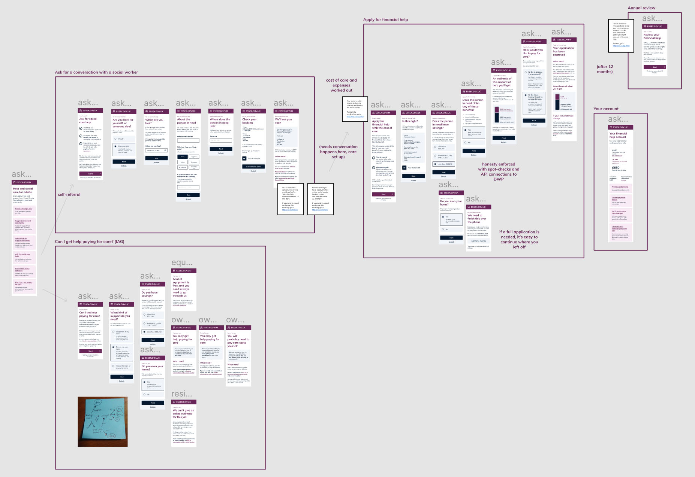

Asking for adult social care help from the council can be a profoundly harrowing experience, often coming right after a crisis point in someone's life.

Uncertainty over paying for care is a big part of that stress.

*Who pays? When? How much? Is my home at risk?*

People tend only to know what their friends have told them, so their knowledge is out of date and their expectations tend to be set high.

Taking inspiration from student finance and the utility supplier start-up [Bulb](https://bulb.co.uk/), I redesigned the entire process of asking for social care help from a council, with a particular focus on the "financial assessment".

What would currently require many paper forms and waiting times of weeks or months is re-imagined as two streamlined online transactions.

Outdated patriarchal terms like "assessments" are rebranded as "conversations". 

The designs do the hard work to synthesise all the information that the council holds and display it in a way that makes sense, rather than relying on the user to do the sums for themselves.

Together with my team, I investigated the technology and data implications of the new user experience and researched the new digital experience with social workers and the public.

It's important to remember that there would always be an [assisted digital](https://www.gov.uk/service-manual/helping-people-to-use-your-service/assisted-digital-support-introduction) aspect to this service for those who cannot or will not use computers, and the best way to improve the quality of that service is to encourage as many people as possible to self-serve via the digital path, reducing demand.