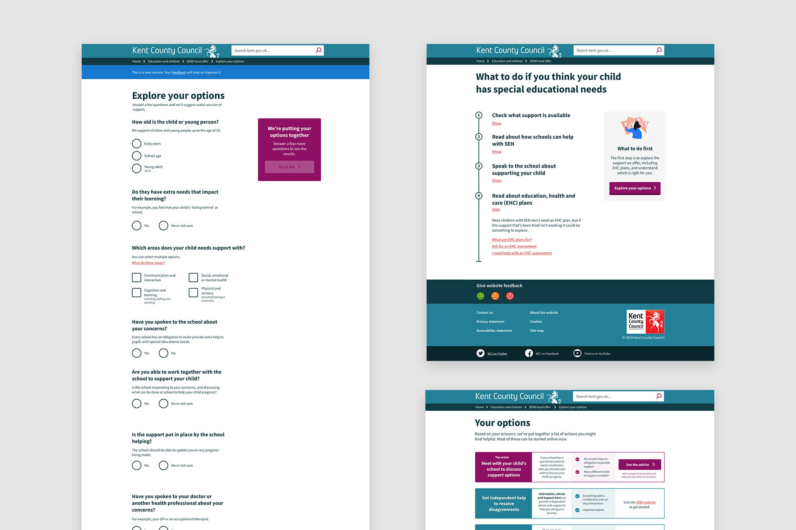
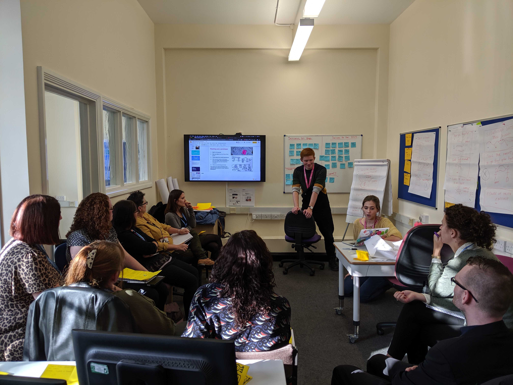

Parents of children with special educational needs tend to be told that the first and best thing to do is to ask the council for an "education, health and care" (EHC) plan.

Often, this is done on the false assumption that having an EHC plan will unlock more funding, or give the parent first dibs on special school places.

In fact, EHC plans are just one kind of support in a complex system, but they are the most recognisable to the public, so it's where all the demand is.

With my team, I designed and prototyped online tools to clear up this misunderstanding and signpost parents to appropriate support for their situation.

The outcome is to make sure children are **getting the support they need**, rather than waiting in a very long, very slow queue for an EHC plan that may not be granted.

At the same time, we **reduce demand** on already-stressed council teams, so they can focus on quality, not quantity.

My team and I conducted user research with our clickable prototypes:

- Redesigned content pages that get rid of long paragraphs and complicated language, replacing it with checklists and small, digestible snippets
- A tool which asks questions and presents a personalised set of recommendations
- An online journey to actually ask for an EHC plan. At the moment, this needs a phone call or letter.

I facilitated co-design sessions with council workers to make sure that the changes we were proposing had wide buy-in.

After going through seven iterations over two months, testing with users as we went, we were happy enough with our prototypes to progress them on to a closed beta.