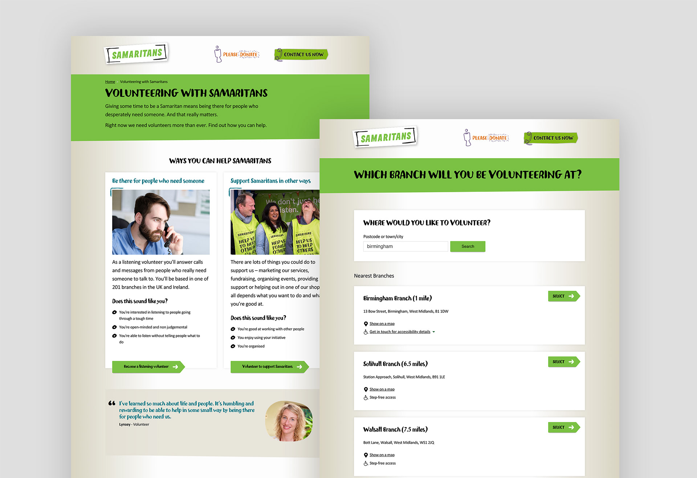
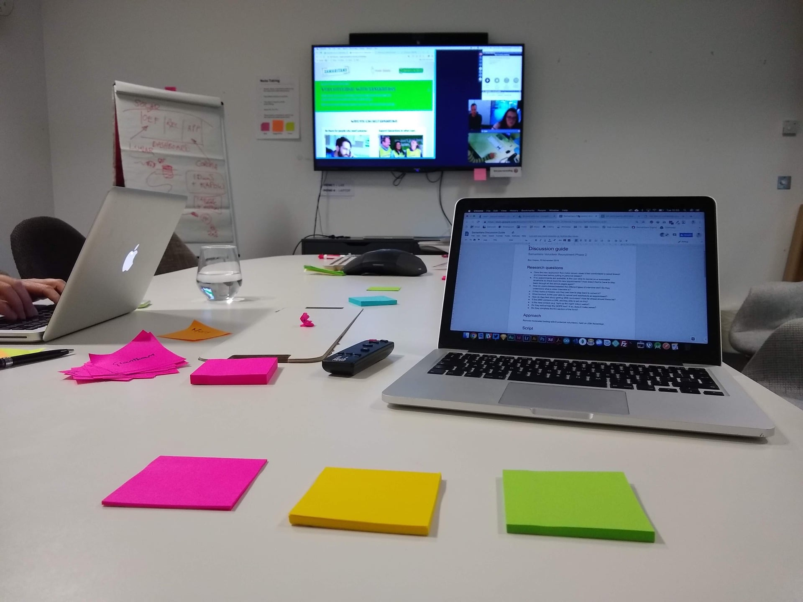
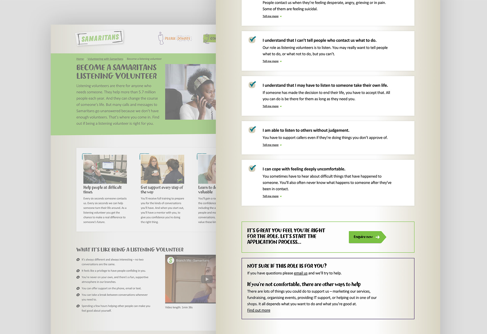

In 2018 I introduced a streamlined, digital volunteer recruitment journey to the suicide prevention helpline charity Samaritans.

Before the new journey, Samaritans was losing volunteers every year. Only **one in ten** applicants made it through the rigorous recruitment and selection process and started staffing the famous 24/7 helpline.

We needed to standardise and shorten the recruitment process, and make it more convenient for people to work through at times that suit them.

I ran user research interviews with potential volunteers and existing volunteers—the people who would administrate the new process, and worked with a product development agency to build the digital tools to enable the new journey.

In a single, immediate online transaction, a user can now:

- Find out what volunteering with Samaritans is like
- See availability at a branch near them
- Book a slot to chat with existing volunteers about the role

Before the changes, that process would have involved lots of phone calls, emails and in-person visits over several weeks.

The products use server-rendered React, driven by an AWS DynamoDB database.

The project is now in a national beta phase.

**[See the new digital recruitment journey](https://volunteer.samaritans.org/volunteer).**

**[See some of the code](https://github.com/samaritans-digital/recruitment-dashboard)**.

Or, [read more about this work](https://samaritans-digital.github.io/volunteer-recruitment-improvements.html).